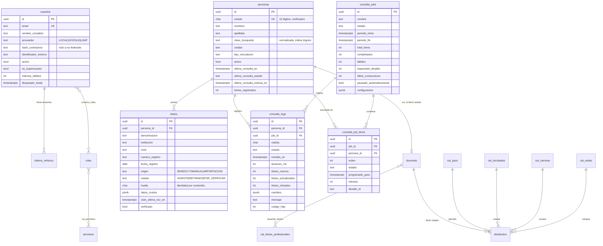

# Modelo de datos

PostgreSQL 18. Once tablas en tres grupos: identidad, nucleo funcional y
consultas.

## Diagrama



---

## Grupo 1 — Identidad y acceso

### `permisos`
Catalogo de 19 permisos atomicos con forma `recurso:accion`. Se siembra al
instalar y crece con el sistema. La autorizacion se evalua siempre contra estos,
nunca contra roles.

### `roles` y `rol_permisos`
Agrupaciones nombradas de permisos. Cuatro roles de sistema —`ADMIN`,
`COORDINADOR`, `ANALISTA`, `CONSULTA`— marcados con `es_sistema = true`, que no
pueden eliminarse. El comando `seed` los resincroniza en cada despliegue: si una
version agrega un permiso, los roles lo reciben sin intervencion manual.

### `usuarios` y `usuario_roles`
Cuentas de acceso. Una restriccion de la base garantiza la coherencia entre el
proveedor y la credencial:

```sql
CHECK (
  (proveedor  = 'LOCAL' AND hash_contrasena       IS NOT NULL) OR
  (proveedor <> 'LOCAL' AND identificador_externo IS NOT NULL)
)
```

Una cuenta de Google no tiene hash de contrasena, y una local no tiene
identificador externo. El invariante vive en la base, no solo en el codigo.

`intentos_fallidos` y `bloqueado_hasta` implementan el bloqueo temporal tras
cinco intentos.

### `tokens_refresco`
Se guarda el **hash HMAC** del token, nunca el token. Si la base se filtra, lo
almacenado no sirve para suplantar a nadie.

`reemplazado_por` encadena la rotacion: al canjear un token se emite otro y se
revoca el anterior. Si llega uno ya revocado, se asume robo y se revocan todas
las sesiones del usuario.

---

## Grupo 2 — Nucleo funcional

### `personas`
El padron del personal.

**`cedula`** es `CHAR(10)` con `CHECK (char_length(cedula) = 10)`, unica. El
digito verificador se valida en el dominio antes de llegar aqui: una cedula
invalida nunca alcanza al proveedor externo, donde consumiria presupuesto de
consultas para producir un error.

**`clave_busqueda`** guarda el texto normalizado —sin acentos, en minusculas— de
nombre, cedula, unidad y codigo de empleado. Lleva un indice GIN con
`gin_trgm_ops`, lo que permite busqueda difusa: escribir «munoz» encuentra
«Muñoz».

**Campos de trazabilidad** (`ultima_consulta_en`, `ultima_consulta_estado`,
`ultima_consulta_exitosa_en`, `titulos_registrados`): son denormalizacion
deliberada. Permiten responder «¿toca reconsultar a esta persona?» y pintar el
listado sin cruzar con `consulta_logs` ni contar `titulos` en cada fila. El
indice `(activo, ultima_consulta_en)` soporta directamente la seleccion de
candidatos de una campana.

### `titulos`

**`huella`** es la pieza central. Identifica al titulo por su **contenido
normalizado**, no por su fila:

- Con numero de registro → `sha256("reg:" + registro_normalizado)`
- Sin el → `sha256("txt:" + denominacion + "|" + institucion)`, normalizados

Restriccion `UNIQUE (persona_id, huella)`. Gracias a ella, el reconciliador
distingue «el proveedor devolvio el mismo titulo otra vez» de «devolvio uno
distinto», incluso cuando el texto llega con acentuacion o espaciado diferente
entre consultas.

**`estado`** distingue tres situaciones:
- `VIGENTE` — presente en la ultima consulta exitosa.
- `RETIRADO` — estaba antes y ya no aparece. **No se borra:** un titulo que
  desaparece del registro nacional es justamente el hallazgo que motiva la
  auditoria, y eliminarlo destruiria la evidencia.
- `POR_VERIFICAR` — cargado a mano, aun sin contraste contra el registro.

**`origen`** determina el nivel de confianza y el comportamiento: el
reconciliador solo marca como retirado lo que el mismo trajo (`SENESCYT`). Un
titulo con respaldo documental fisico (`MANUAL`) no se degrada porque el
registro nacional no lo liste.

**`datos_crudos`** (JSONB) conserva la respuesta original del proveedor. Permite
reprocesar sin volver a consultar cuando se corrige el mapeo.

---

## Grupo 3 — Consultas

### `consulta_logs`
Historico **solo de insercion**: nunca se actualiza ni se borra.

Se escribe una fila en todos los casos —exito, sin datos, error de red, rechazo,
cedula invalida, desafio pendiente—. Es la garantia que hace auditable el
proceso.

`cambios` (JSONB) guarda el detalle de lo que cambio, campo a campo, con el
valor anterior y el nuevo.

Indices: `(persona_id, iniciado_en)` para el historico de una persona,
`(estado, iniciado_en)` para filtrar errores, e `iniciado_en` a secas para el
conteo del presupuesto horario.

### `consulta_jobs`
Campana que recorre el padron dentro de un periodo.

`configuracion` (JSONB) guarda una **instantanea de la politica de ritmo** en el
momento de crear el job. Hace reproducible el resultado: se sabe con que
parametros se ejecuto, aunque despues se cambien.

`fallos_consecutivos` y `pausado_automaticamente` implementan el cortacircuitos.

### `consulta_job_items`
El cursor que hace reanudable una campana de varios dias.

`UNIQUE (job_id, persona_id)`: nadie aparece dos veces en la misma campana.

El indice `(job_id, estado, programado_para)` soporta la reclamacion del
siguiente item, que se hace con `FOR UPDATE SKIP LOCKED`. Esa clausula es lo que
permite varios trabajadores en paralelo sin que dos tomen la misma persona.

---

## Grupo 4 — Distributivo docente

### Los doce catalogos

Doce tablas con la **misma forma**: `cat_paos`, `cat_facultades`, `cat_carreras`,
`cat_sedes`, `cat_titularidades`, `cat_dedicaciones`, `cat_categorias`,
`cat_niveles`, `cat_programas`, `cat_titulos_profesionales`,
`cat_tipos_titulo`, `cat_generos`.

| Columna | Tipo | Nota |
|---|---|---|
| `id` | `UUID` | PK |
| `codigo` | `VARCHAR(320)` | UK. **El texto con que el consolidado nombraba el elemento**, sin capitalizar |
| `nombre` | `VARCHAR(320)` | Como se muestra en pantalla |
| `activo` | `BOOL` | Desactivar saca del selector sin tocar el historico |
| `orden` | `INT` | Orden de presentacion |
| `atributos` | `JSONB` | Lo propio de cada catalogo. En `cat_paos`: `anio` y `periodo` |

**Por que doce tablas y no una con discriminador.** Con una sola tabla, la clave
foranea de `distributivo.carrera_id` no podria garantizar que apunta a una
carrera: aceptaria cualquier fila, incluida una facultad. La integridad
referencial es justamente lo que se quiere de una base de datos. El codigo no se
duplica: las doce comparten repositorio, casos de uso, router y componente, y el
tipo selecciona la tabla a traves de `MODELOS_CATALOGO`.

**Por que 320 caracteres.** Un titulo individual del padron llega a 199. El
limite anterior de 160 rompia la importacion.

**Por que `codigo` conserva el texto crudo.** Es lo que permite reproducir el
archivo de origen para compararlo. Si solo se guardara `nombre`, cada celda de
texto figuraria como diferencia por una cuestion de mayusculas.

### `docentes`

| Columna | Tipo | Nota |
|---|---|---|
| `identificacion` | `VARCHAR(20)` | UK. **Cedula o pasaporte**: el padron docente incluye extranjeros |
| `nombre_completo` | `VARCHAR(200)` | En mayusculas, normalizado |
| `genero_id` | `UUID` | → `cat_generos` |
| `persona_id` | `UUID` | → `personas`, **nullable**. Quien tiene pasaporte no tiene expediente que enlazar |
| `clave_busqueda` | `TEXT` | Indice trigram |

`docente_titulos` relaciona el docente con sus titulos profesionales y guarda el
`orden` en que el consolidado los traia.

### `distributivo`

La carga de un docente en una carrera durante un periodo.

| Columna | Tipo | Nota |
|---|---|---|
| `docente_id`, `pao_id`, `facultad_id`, `carrera_id` | `UUID` | Obligatorias |
| `programa_id`, `sede_id`, `nivel_id`, `titularidad_id`, `dedicacion_id`, `categoria_id`, `tipo_titulo_id` | `UUID` | Opcionales |
| `asignatura` | `VARCHAR(400)` | **No viene del origen.** Se captura a mano; nula mientras nadie la complete |
| `horas` | `JSONB` | Las 47 subactividades (`Da`..`Dn`, `Ga`..`Gn`, `Ia`..`Ij`, `Va`..`Vi`) |
| `total_docencia`, `total_gestion`, `total_investigacion`, `total_vinculacion`, `total_horas` | `NUMERIC` | Derivadas del JSONB, materializadas para poder filtrar y sumar en SQL |
| `medida` | `TEXT` | Medida administrativa del periodo |

**Clave natural:**

```sql
UNIQUE NULLS NOT DISTINCT (docente_id, pao_id, carrera_id, sede_id)
```

La sede entra porque un docente **si** dicta la misma carrera en dos campus el
mismo periodo: 118 de los 154 grupos que parecian duplicados eran eso.
`NULLS NOT DISTINCT` cierra el agujero de las 19 filas sin sede, que PostgreSQL
consideraria distintas entre si por omision.

**Por que las 47 horas van en `JSONB` y los totales en columnas reales.** Las
subactividades se leen y se escriben siempre juntas, nunca se filtran una a una,
y el origen puede sumar columnas nuevas sin migrar la tabla. Los totales, en
cambio, se filtran y se agregan en cada listado y en cada reporte: ahi una
columna indexable vale mas que la flexibilidad.

---

## Convenciones

| Aspecto | Decision | Motivo |
|---|---|---|
| Claves primarias | UUID v4, generado por `gen_random_uuid()` | No revelan volumen ni orden de alta; permiten generar el id antes de insertar |
| Fechas | `TIMESTAMPTZ`, siempre en UTC | La conversion a hora de Ecuador ocurre solo en los bordes |
| Enumeraciones | `VARCHAR` con el valor textual | Agregar un valor no exige migrar un tipo enum de PostgreSQL |
| Datos flexibles | `JSONB` | Respuestas del proveedor y configuracion, que no tienen esquema fijo |
| Nombres de restricciones | Convencion explicita en `Base.metadata` | Sin ella, Alembic genera nombres distintos por entorno y las migraciones dejan de ser reversibles |
| Borrado | `ON DELETE CASCADE` desde `personas`; `SET NULL` hacia `usuarios` | Borrar una persona limpia su expediente; borrar un usuario no destruye la auditoria |

## Extensiones requeridas

Las instala `infra/postgres/init/01-extensions.sql` al crear el volumen:

- `pgcrypto` — `gen_random_uuid()`
- `pg_trgm` — busqueda por similitud sobre `clave_busqueda`
- `unaccent` — normalizacion de acentos

## Migraciones

Alembic en modo asincrono, sobre el mismo driver que la aplicacion. La URL sale
de la configuracion tipada, no del `alembic.ini`, para que las credenciales
vivan en un solo lugar.

```bash
make migration m="descripcion del cambio"   # generar
make migrate                                 # aplicar
make downgrade                               # revertir la ultima
```

Hay una prueba de integracion —`test_migraciones.py`— que compara el esquema que
producen las migraciones contra el que describen los modelos. Si alguien cambia
un modelo y olvida generar la migracion, la prueba falla antes del despliegue.
